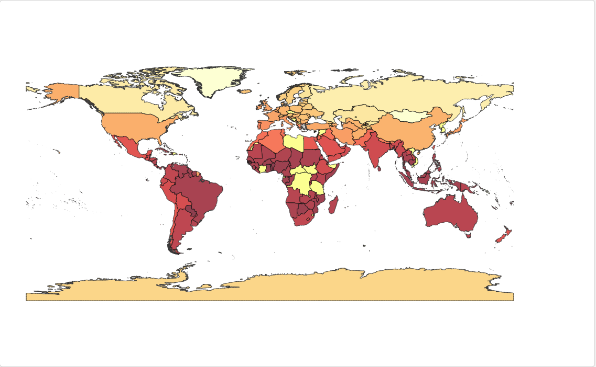
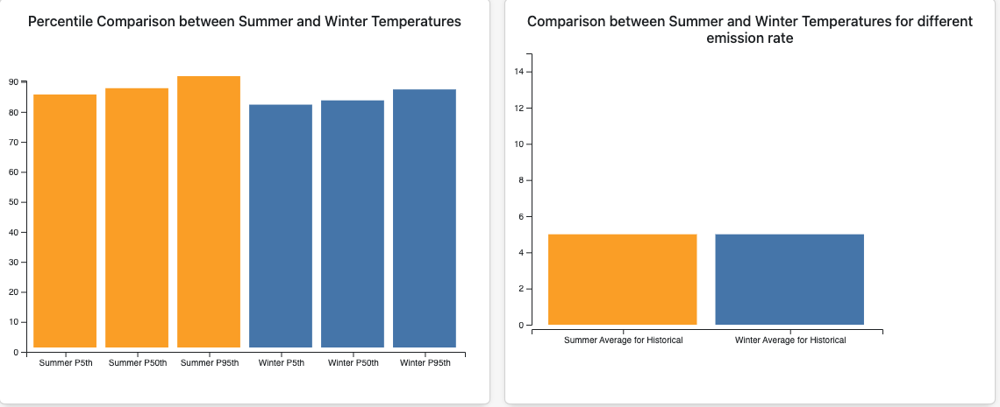

# Climatics: Analysis of Climate Change Impact

## Overview
This project explores the profound impacts of climate change on human mortality and global economies. By analyzing detailed datasets, the project highlights the relationships between greenhouse gas emissions, seasonal temperature variations, and their implications on ecosystems and human activities. Advanced data visualization techniques were employed to make complex data accessible and actionable for diverse audiences.

---

## Dataset
The dataset merges data from multiple sources, including:
- **Summer and Winter Average Temperatures**
- **Extreme temperature occurrences** (e.g., days exceeding 95°F or below 32°F)
- **Mortality and Energy-related damages**

---

## Analytical Goals
1. **Spatial Analysis of Emission Rates**:
   - Identify regions with the highest and lowest greenhouse gas emissions under different climate scenarios (RCPs).

2. **Seasonal Temperature Variation Assessment**:
   - Compare percentile distributions of summer and winter temperatures to evaluate seasonal shifts and impacts over time.

3. **Correlation Analysis Between Emissions and Temperatures**:
   - Understand how emissions influence seasonal climate patterns and identify direct effects of human activities.

---

## Visualizations
### Dashboard Design
The visualization dashboard includes:
1. **Interactive Geo-Map**:
   - Allows users to explore global temperature trends under various emission scenarios (RCP 4.5 and RCP 8.5).
   - Interactive features include country selection and tooltips to display emission rates and temperature details.

2. **Bar Graphs**:
   - Display seasonal temperature variations under different emission scenarios.
   - Compare 5th, 50th, and 95th percentiles of summer and winter temperatures.

**Example Visuals**:

## Implementation
### Tools and Process
- Initial visualizations were created in **Tableau** to explore data trends.
- Final implementation transitioned to **D3.js** for greater flexibility and interactivity.

### Key Features
1. **Dynamic Geo-Map**:
   - Interactive selection of emission scenarios and temperature data.
2. **Bar Charts**:
   - Seasonal comparisons with percentile data for better decision-making.
3. **Tooltips**:
   - Provide on-hover details, including country name, emission rate, and temperature.

---

